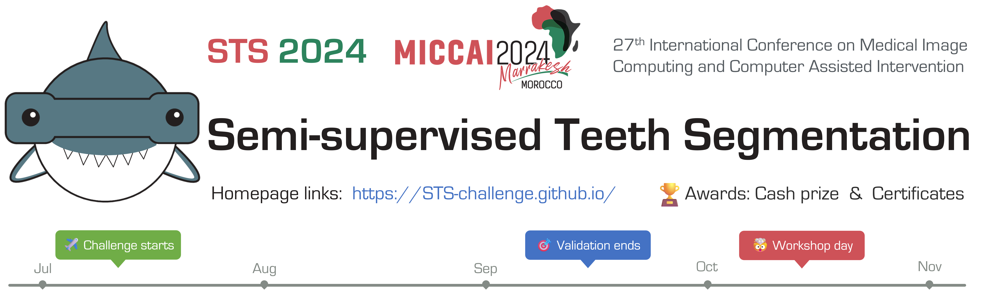

  
  
&nbsp;

  

    <b>Codabench website</b>
    
      <a href="https://www.codabench.org/competitions/3024">
        <i>HOT</i>
      </a>
    
    &nbsp;&nbsp;&nbsp;&nbsp;&nbsp;
    <b>Challenge baselines</b>
    
      <a href="#">
        <i>TRY IT OUT</i>
      </a>
    
  

  
&nbsp;

STS 2023: Tooth region segmentation in 2D panoramic X-ray images and 3D dental CBCT scans _(still open)_.</b> 

  
